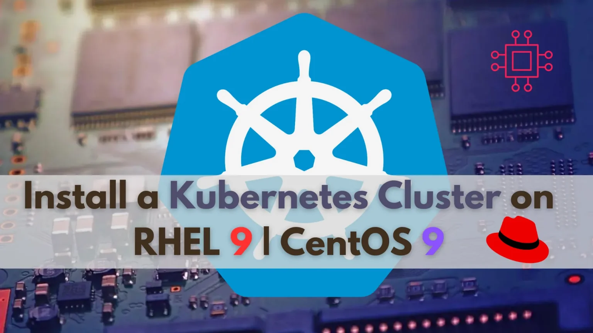

# Introduction 

Are you ready to dive into the world of Kubernetes on Red Hat Enterprise Linux 9 or CentOS 9?

# Why Kubernetes? 

Before we derive into the installation process, let’s quickly touch upon why Kubernetes has become the de facto standard for container orchestration. Kubernetes simplifies the management and deployment of containerized applications, providing features like automated scaling, load balancing, and self-healing capabilities. Whether you’re running a small-scale project or managing a large-scale enterprise application, Kubernetes offers the flexibility and scalability you need.

## Prerequisites

Before we begin the installation process, ensure you have the following prerequisites:

- A minimum of three nodes (one master and two worker nodes) running either Red Hat Enterprise Linux 9 or CentOS 9.
- Each node should have a minimum of 4GB RAM and 2 CPU cores.
- If you do not have a DNS setup, each node should have the following entries in the /etc/hosts file: 

Kubernetes Cluster host entry.

    192.168.1.26 	k8s-master.blackhat.com    # Replace with your actual hostname and IP address
    192.168.1.27 	k8s-worker1.blackhat.com   # Replace with your actual hostname and IP address
    192.168.1.28 	k8s-worker2.blackhat.com   # Replace with your actual hostname and IP address
    
For demonstration purposes, we’ve configured our Linux nodes as follows:

|Hostname                |RAM  | CPU in Cores  | OS                 |
|------------------------|-----|---------------|--------------------|
|k8s-master.blackhat.com |   4 |  2       |RedHat Enterprise Linux 9|
|k8s-worker1.blackhat.com|   4 |  2       |RedHat Enterprise Linux 9|
|k8s-worker2.blackhat.com|   4 |  2       |RedHat Enterprise Linux 9|

# Install a Kubernetes Cluster on RHEL 9 | CentOS 9
## Step 1: Install Kernel Headers

First, ensure that you have the appropriate kernel headers installed on your system (on each node). You can install them using the following command:

    [root@test-vm-01 ~]# sudo dnf install kernel-devel-$(uname -r)

## Step 2: Add Kernel Modules

To load the necessary kernel modules required by Kubernetes, you can use the modprobe command followed by the module names (on each node). Here’s how you can do it:

    [root@test-vm-01 ~]# sudo modprobe br_netfilter
    [root@test-vm-01 ~]# sudo modprobe ip_vs
    [root@test-vm-01 ~]# sudo modprobe ip_vs_rr
    [root@test-vm-01 ~]# sudo modprobe ip_vs_wrr
    [root@test-vm-01 ~]# sudo modprobe ip_vs_sh
    [root@test-vm-01 ~]# sudo modprobe overlay

These commands load the required kernel modules (br_netfilter, ip_vs, ip_vs_rr, ip_vs_wrr, ip_vs_sh, overlay) that are essential for Kubernetes to function properly and facilitate communication within the Kubernetes cluster.

By loading these modules, you ensure that your servers are prepared for Kubernetes installation and can effectively manage networking and load balancing tasks within the cluster.

Next, create a configuration file (as the root user on each node) to ensure these modules load at system boot:

    [root@test-vm-01 ~]# cat > /etc/modules-load.d/kubernetes.conf << EOF
    br_netfilter
    ip_vs
    ip_vs_rr
    ip_vs_wrr
    ip_vs_sh
    overlay
    EOF
    
## Step 3: Configure Sysctl

To set specific sysctl settings (on each node) that Kubernetes relies on, you can update the system’s kernel parameters. These settings ensure optimal performance and compatibility for Kubernetes. Here’s how you can configure the necessary sysctl settings:

    [root@test-vm-01 ~]# cat > /etc/sysctl.d/kubernetes.conf << EOF
    net.ipv4.ip_forward = 1
    net.bridge.bridge-nf-call-ip6tables = 1
    net.bridge.bridge-nf-call-iptables = 1
    EOF    

These commands adjust the following kernel parameters:

|        Kernel Parameter                 |                    Description                         |
|-----------------------------------------|--------------------------------------------------------|
| net.bridge.bridge-nf-call-iptables      | Enables iptables to process bridged IPv4 traffic.      |
| net.bridge.bridge-nf-call-ip6tables     | Enables iptables to process bridged IPv6 traffic.      |
| net.ipv4.ip_forward                     | Enables IPv4 packet forwarding.                        |

By setting these sysctl parameters, you ensure that your system is properly configured to support Kubernetes networking requirements and forwarding of network traffic within the cluster. These settings are essential for the smooth operation of Kubernetes networking components. Run the following command to apply the changes:

    [root@test-vm-01 ~]# sysctl --system
    
    * Applying /usr/lib/sysctl.d/10-default-yama-scope.conf ...
    * Applying /usr/lib/sysctl.d/50-coredump.conf ...
    * Applying /usr/lib/sysctl.d/50-default.conf ...
    * Applying /usr/lib/sysctl.d/50-libkcapi-optmem_max.conf ...
    * Applying /usr/lib/sysctl.d/50-pid-max.conf ...
    * Applying /usr/lib/sysctl.d/50-redhat.conf ...
    * Applying /etc/sysctl.d/99-sysctl.conf ...
    * Applying /etc/sysctl.d/kubernetes.conf ...
    * Applying /etc/sysctl.conf ...
    ...omitted parts of the output for brevity...
    kernel.kptr_restrict = 1
    net.ipv4.conf.default.rp_filter = 1
    net.ipv4.conf.enp1s0.rp_filter = 1
    net.ipv4.conf.lo.rp_filter = 1
    net.ipv4.ip_forward = 1
    net.bridge.bridge-nf-call-ip6tables = 1
    net.bridge.bridge-nf-call-iptables = 1

## Step 4: Disabling Swap

To disable swap on each server in your Kubernetes cluster, you can follow these steps:

    [root@test-vm-01 ~]# sudo swapoff -a

This command turns off all swap devices.

    [root@test-vm-01 ~]# sed -e '/swap/s/^/#/g' -i /etc/fstab

## Step 5: Install Kubernetes Components

To install Kubernetes components (kubelet, kubeadm, and kubectl) and add the Kubernetes repository to your package manager, you can follow these steps:

### Add Kubernetes Repository

First, add the Kubernetes repository (as the root user) to your package manager. For example, on RHEL/CentOS version 8+, you can use the following command:

    [root@test-vm-01 ~]# cat <<EOF | sudo tee /etc/yum.repos.d/kubernetes.repo
    [kubernetes]
    name=Kubernetes
    baseurl=https://pkgs.k8s.io/core:/stable:/v1.29/rpm/
    enabled=1
    gpgcheck=1
    gpgkey=https://pkgs.k8s.io/core:/stable:/v1.29/rpm/repodata/repomd.xml.key
    EOF

### Install Kubernetes Packages

Once the repository is added, you can proceed to install the Kubernetes components (kubelet, kubeadm, and kubectl) using the package manager. Run the following command:

    [root@test-vm-01 ~]# dnf makecache; dnf install -y kubelet kubeadm kubectl --disableexcludes=kubernetes

### Start and Enable kubelet Service

After installing kubelet, start and enable the kubelet service to ensure it starts automatically upon system boot:

    [root@test-vm-01 ~]# systemctl enable --now kubelet.service crio.service

## Step 6: Initializing Kubernetes Control Plane
Great! Let’s proceed with initializing the Kubernetes control plane on the master node. Here’s how we can do it:

    [root@test-vm-01 ~]# sudo kubeadm config images pull
    [config/images] Pulled registry.k8s.io/kube-apiserver:v1.29.3
    [config/images] Pulled registry.k8s.io/kube-controller-manager:v1.29.3
    [config/images] Pulled registry.k8s.io/kube-scheduler:v1.29.3
    [config/images] Pulled registry.k8s.io/kube-proxy:v1.29.3
    [config/images] Pulled registry.k8s.io/coredns/coredns:v1.11.1
    [config/images] Pulled registry.k8s.io/pause:3.9
    [config/images] Pulled registry.k8s.io/etcd:3.5.12-0

After executing this command, Kubernetes will pull the necessary container images from the default container registry (usually Docker Hub) and store them locally on the machine. This step is typically performed before initializing the Kubernetes cluster to ensure that all required images are available locally and can be used without relying on an external registry during cluster setup.
    
    [root@test-vm-01 ~]# sudo kubeadm init --pod-network-cidr=10.244.0.0/16
    
    Your Kubernetes control-plane has initialized successfully!
    
    To start using your cluster, you need to run the following as a regular user:
    
      mkdir -p $HOME/.kube
      sudo cp -i /etc/kubernetes/admin.conf $HOME/.kube/config
      sudo chown $(id -u):$(id -g) $HOME/.kube/config
    
    Alternatively, if you are the root user, you can run:
    
      export KUBECONFIG=/etc/kubernetes/admin.conf
    
    You should now deploy a pod network to the cluster.
    Run "kubectl apply -f [podnetwork].yaml" with one of the options listed at:
      https://kubernetes.io/docs/concepts/cluster-administration/addons/
    
    Then you can join any number of worker nodes by running the following on each as root:
    
    kubeadm join 192.168.1.26:6443 --token y8cow4.jib2syhyrb0bh1dt \
    	--discovery-token-ca-cert-hash sha256:cb67fddec41469cf1f495db34008ae1a41d3f24ce418b46d5aefb262a1721f43

### Set Up kubeconfig File

Set up the kubeconfig file to enable communication with the Kubernetes cluster. Run the following commands:
    
    [root@test-vm-01 ~]# mkdir -p $HOME/.kube
    [root@test-vm-01 ~]# sudo cp -i /etc/kubernetes/admin.conf $HOME/.kube/config
    [root@test-vm-01 ~]# sudo chown $(id -u):$(id -g) $HOME/.kube/config

## Step 7: Install Cilium on the master node only.

    [root@test-vm-01 ~]# CILIUM_CLI_VERSION=$(curl -s https://raw.githubusercontent.com/cilium/cilium-cli/main/stable.txt)
    [root@test-vm-01 ~]# CLI_ARCH=amd64
    [root@test-vm-01 ~]# if [ "$(uname -m)" = "aarch64" ]; then CLI_ARCH=arm64; fi
    [root@test-vm-01 ~]# curl -L --fail --remote-name-all https://github.com/cilium/cilium-cli/releases/download/${CILIUM_CLI_VERSION}/cilium-linux-${CLI_ARCH}.tar.gz{,.sha256sum}
    [root@test-vm-01 ~]# sha256sum --check cilium-linux-${CLI_ARCH}.tar.gz.sha256sum
    [root@test-vm-01 ~]# sudo tar xzvfC cilium-linux-${CLI_ARCH}.tar.gz /usr/local/bin
    [root@test-vm-01 ~]# rm cilium-linux-${CLI_ARCH}.tar.gz{,.sha256sum}
    [root@test-vm-01 ~]# cilium install --version 1.14.2

check the status.

    [root@test-vm-01 ~]# cilium status --wait
        /¯¯\
     /¯¯\__/¯¯\    Cilium:             OK
     \__/¯¯\__/    Operator:           OK
     /¯¯\__/¯¯\    Envoy DaemonSet:    disabled (using embedded mode)
     \__/¯¯\__/    Hubble Relay:       disabled
        \__/       ClusterMesh:        disabled
    
    DaemonSet              cilium             Desired: 1, Ready: 1/1, Available: 1/1
    Deployment             cilium-operator    Desired: 1, Ready: 1/1, Available: 1/1
    Containers:            cilium             Running: 1
                           cilium-operator    Running: 1
    Cluster Pods:          2/2 managed by Cilium
    Helm chart version:    1.14.2
    Image versions         cilium             quay.io/cilium/cilium:v1.14.2@sha256:6263f3a3d5d63b267b538298dbeb5ae87da3efacf09a2c620446c873ba807d35: 1
                           cilium-operator    quay.io/cilium/operator-generic:v1.14.2@sha256:52f70250dea22e506959439a7c4ea31b10fe8375db62f5c27ab746e3a2af866d: 1
    
    
    
Then you can run the connectivity test. Some of the egress test will fail because we don’t have a public IP on the cluster.
    
        
    [root@test-vm-01 ~]# cilium connectivity test
    ℹ️  Monitor aggregation detected, will skip some flow validation steps
    ✨ [kubernetes] Creating namespace cilium-test-1 for connectivity check...
    ✨ [kubernetes] Deploying echo-same-node service...
    ✨ [kubernetes] Deploying DNS test server configmap...
    ✨ [kubernetes] Deploying same-node deployment...
    ✨ [kubernetes] Deploying client deployment...
    ✨ [kubernetes] Deploying client2 deployment...
    ⌛ [kubernetes] Waiting for deployment cilium-test-1/client to become ready...
    ⌛ [kubernetes] Waiting for deployment cilium-test-1/client2 to become ready...
    ⌛ [kubernetes] Waiting for deployment cilium-test-1/echo-same-node to become ready...
    ⌛ [kubernetes] Waiting for pod cilium-test-1/client2-6b89df6c77-6j2l7 to reach DNS server on cilium-test-1/echo-same-node-6bbbcd7755-2d9mm pod...    
    ........
    [=] [cilium-test-1] Skipping test [pod-to-controlplane-host] [75/86] (skipped by condition)
    [=] [cilium-test-1] Skipping test [pod-to-controlplane-host-cidr] [77/86] (skipped by condition)
    [=] [cilium-test-1] Skipping test [pod-to-k8s-on-controlplane] [76/86] (skipped by condition)
    [=] [cilium-test-1] Skipping test [pod-to-k8s-on-controlplane-cidr] [78/86] (skipped by condition)
    [=] [cilium-test-1] Skipping test [local-redirect-policy] [79/86] (skipped by condition)
    [=] [cilium-test-1] Skipping test [bgp-control-plane-v1] [82/86] (skipped by condition)
    [=] [cilium-test-1] Skipping test [bgp-control-plane-v2] [83/86] (skipped by condition)
    [=] [cilium-test-1] Skipping test [local-redirect-policy-with-node-dns] [80/86] (skipped by condition)
    [=] [cilium-test-1] Skipping test [host-firewall-ingress] [84/86] (skipped by condition)
    [=] [cilium-test-1] Skipping test [host-firewall-egress] [85/86] (skipped by condition)
    [=] [cilium-test-1] Skipping test [pod-to-pod-no-frag] [81/86] (skipped by condition)
    [=] [cilium-test-1] Test [check-log-errors] [86/86]
    .
    ✅ [cilium-test-1] All 45 tests (191 actions) successful, 41 tests skipped, 1 scenarios skipped.

## Step 8: Getting all pods status. 

    [root@test-vm-01 ~]# kubectl get po -A
    NAMESPACE     NAME                                             READY   STATUS    RESTARTS   AGE
    kube-system   cilium-4sgh6                                     1/1     Running   0          39m
    kube-system   cilium-operator-5db6b54b45-p6xmg                 1/1     Running   0          39m
    kube-system   coredns-76f75df574-pct6b                         1/1     Running   0          38m
    kube-system   coredns-76f75df574-wvm9p                         1/1     Running   0          38m
    kube-system   etcd-test-vm-01.example.com                      1/1     Running   1          40m
    kube-system   kube-apiserver-test-vm-01.example.com            1/1     Running   1          40m
    kube-system   kube-controller-manager-test-vm-01.example.com   1/1     Running   2          40m
    kube-system   kube-proxy-rszpt                                 1/1     Running   0          40m
    kube-system   kube-scheduler-test-vm-01.example.com            1/1     Running   2          40m
    
