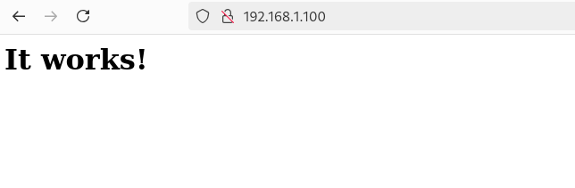

### What is MetalLB?

MetalLB is a pure software solution that provides a network load-balancer implementation for Kubernetes clusters that are not deployed in supported cloud provider using standard routing protocols. By installing MetalLB solution, you effectively get LoadBalancer Services within your Kubernetes cluster.

### MetalLB have the following requirement to function:

- A Kubernetes cluster on version 1.13.0 or later. The cluster should not have another network load-balancing functionality.
- A cluster network configuration that can coexist with MetalLB.
- Availability of IPv4 addresses that MetalLB will assign to LoadBalancer services when requested.
- If using BGP operating mode, one or more routers capable of speaking BGP are required.
- When using the L2 operating mode, traffic on port 7946 (TCP & UDP, other port can be configured) must be allowed between nodes, as required by memberlist.

### Install MetalLB Load Balancer on Kubernetes Cluster

Confirm if your Kubernetes Cluster API is responsive and you’re able to use kubectl cluster administration command-line tool:

    [root@test-vm-01 ~]# kubectl cluster-info
    Kubernetes control plane is running at https://192.168.1.54:6443
    CoreDNS is running at https://192.168.1.54:6443/api/v1/namespaces/kube-system/services/kube-dns:dns/proxy
    
    To further debug and diagnose cluster problems, use 'kubectl cluster-info dump'.
    
### Preparation

If in your Kubernetes cluster you’re using kube-proxy in IPVS mode, you need to enable strict ARP mode. Edit the kube-system config:

Enable strictARP for ipvs:

    # see what changes would be made, returns nonzero returncode if different
    [root@test-vm-01 ~]# kubectl get configmap kube-proxy -n kube-system -o yaml | \
    sed -e "s/strictARP: false/strictARP: true/" | \
    kubectl diff -f - -n kube-system
    
    # actually apply the changes, returns nonzero returncode on errors only
    [root@test-vm-01 ~]# kubectl get configmap kube-proxy -n kube-system -o yaml | \
    sed -e "s/strictARP: false/strictARP: true/" | \
    kubectl apply -f - -n kube-system

### Download MetalLB installation manifest

Get the latest MetalLB release tag:

    [root@test-vm-01 ~]# MetalLB_RTAG=$(curl -s https://api.github.com/repos/metallb/metallb/releases/latest|grep tag_name|cut -d '"' -f 4|sed 's/v//')

To check release tag use echo command:

    [root@test-vm-01 ~]# echo $MetalLB_RTAG

Create directory where manifests will be downloaded to.

    [root@test-vm-01 ~]# mkdir ~/metallb && cd ~/metallb

Download MetalLB installation manifest:

    [root@test-vm-01 ~]# wget https://raw.githubusercontent.com/metallb/metallb/v$MetalLB_RTAG/config/manifests/metallb-native.yaml

### Install MetalLB Load Balancer on Kubernetes cluster

To install MetalLB, apply the manifest:

    [root@test-vm-01 ~]# kubectl apply -f metallb-native.yaml
    namespace/metallb-system created
    customresourcedefinition.apiextensions.k8s.io/addresspools.metallb.io created
    customresourcedefinition.apiextensions.k8s.io/bfdprofiles.metallb.io created
    customresourcedefinition.apiextensions.k8s.io/bgpadvertisements.metallb.io created
    customresourcedefinition.apiextensions.k8s.io/bgppeers.metallb.io created
    customresourcedefinition.apiextensions.k8s.io/communities.metallb.io created
    customresourcedefinition.apiextensions.k8s.io/ipaddresspools.metallb.io created
    customresourcedefinition.apiextensions.k8s.io/l2advertisements.metallb.io created
    serviceaccount/controller created
    serviceaccount/speaker created
    Warning: policy/v1beta1 PodSecurityPolicy is deprecated in v1.21+, unavailable in v1.25+
    podsecuritypolicy.policy/controller created
    podsecuritypolicy.policy/speaker created
    role.rbac.authorization.k8s.io/controller created
    role.rbac.authorization.k8s.io/pod-lister created
    clusterrole.rbac.authorization.k8s.io/metallb-system:controller created
    clusterrole.rbac.authorization.k8s.io/metallb-system:speaker created
    rolebinding.rbac.authorization.k8s.io/controller created
    rolebinding.rbac.authorization.k8s.io/pod-lister created
    clusterrolebinding.rbac.authorization.k8s.io/metallb-system:controller created
    clusterrolebinding.rbac.authorization.k8s.io/metallb-system:speaker created
    secret/webhook-server-cert created
    service/webhook-service created
    deployment.apps/controller created
    daemonset.apps/speaker created
    validatingwebhookconfiguration.admissionregistration.k8s.io/metallb-webhook-configuration created

The command we executed deploys MetalLB to your Kubernetes cluster, under the metallb-system namespace.

    [root@test-vm-01 ~]# kubectl get ns metallb-system
    NAME             STATUS   AGE
    metallb-system   Active   149m

Waif for everything to be in running state, then you can list running Pods:

    [root@test-vm-01 ~]# kubectl get pods  -n metallb-system
    NAME             STATUS   AGE
    metallb-system   Active   149m

### Create Load Balancer services Pool of IP Addresses

MetalLB needs a pool of IP addresses to assign to the services when it gets such request. We have to instruct MetalLB to do so via the IPAddressPool CR.

Let’s create a file with configurations for the IPs that MetalLB uses to assign IPs to services. In the configuration the pool has IPs range 192.168.1.100-192.168.1.200.
        
    [root@test-vm-01 ~]# cat ip_add_pool.yaml 
    apiVersion: metallb.io/v1beta1
    kind: IPAddressPool
    metadata:
      name: ipsource
      namespace: metallb-system
    spec:
      addresses:
      - 192.168.1.100-192.168.1.200

### Announce service IPs after creation

This is a sample configuration used to advertise all IP address pools created in the cluster.
Advertisement can also be limited to a specific Pool. In the example the limit is to the ipsource pool.

    [root@test-vm-01 ~]# cat l2-adv.yaml 
    apiVersion: metallb.io/v1beta1
    kind: L2Advertisement
    metadata:
      name: l2adv
      namespace: metallb-system
    spec:
      ipAddressPools:
      - ipsource
    
Multiple instances of IPAddressPools can co-exist and addresses can be defined by CIDR, by range, and both IPV4 and IPV6 addresses can be assigned.

Apply the configuration using kubectl command:

    [root@test-vm-01 ~]# kubectl create -f ip_add_pool.yaml 
    ipaddresspool.metallb.io/ipsource created
    
    [root@test-vm-01 ~]# kubectl create -f l2-adv.yaml 
    l2advertisement.metallb.io/l2adv created
    

To check endpoint run:

    [root@test-vm-01 ~]# kubectl get endpoints  -n metallb-system
    NAME              ENDPOINTS         AGE
    webhook-service   10.0.0.241:9443   162m
    
List created IP Address Pools and Advertisements:

    [root@test-vm-01 ~]# kubectl get ipaddresspools.metallb.io -n metallb-system
    NAME       AUTO ASSIGN   AVOID BUGGY IPS   ADDRESSES
    ipsource   true          false             ["192.168.1.100-192.168.1.200"]
    
    
Get more details using describe kubectl command option:

    [root@test-vm-01 ~]# kubectl get l2advertisements.metallb.io -n metallb-system
    NAME    IPADDRESSPOOLS   IPADDRESSPOOL SELECTORS   INTERFACES
    l2adv   ["ipsource"]                               
    [root@test-vm-01 ~]# 

Get more details using describe kubectl command option:
    
    [root@test-vm-01 ~]# kubectl describe ipaddresspools.metallb.io ipsource -n metallb-system
    Name:         ipsource
    Namespace:    metallb-system
    Labels:       <none>
    Annotations:  <none>
    API Version:  metallb.io/v1beta1
    Kind:         IPAddressPool
    Metadata:
      Creation Timestamp:  2024-10-27T09:53:33Z
      Generation:          1
      Resource Version:    29505
      UID:                 63bce505-48a1-4a1f-baa2-6388f2ddb745
    Spec:
      Addresses:
        192.168.1.100-192.168.1.200
      Auto Assign:       true
      Avoid Buggy I Ps:  false
    Events:              <none>

## Deploying services that use MetalLB LoadBalancer
With the MetalLB installed and configured, we can test by creating service with spec.type set to LoadBalancer, and MetalLB will do the rest. This exposes a service externally.

MetalLB attaches informational events to the services that it’s controlling. If your LoadBalancer is misbehaving, run kubectl describe service <service name> and check the event log.

We can test with this service:

    [root@test-vm-01 ~]# vim web-app-demo.yaml
    apiVersion: v1
    kind: Namespace
    metadata:
      name: web
    ---
    apiVersion: apps/v1
    kind: Deployment
    metadata:
      name: web-server
      namespace: web
    spec:
      selector:
        matchLabels:
          app: web
      template:
        metadata:
          labels:
            app: web
        spec:
          containers:
          - name: httpd
            image: httpd:alpine
            ports:
            - containerPort: 80
    ---
    apiVersion: v1
    kind: Service
    metadata:
      name: web-server-service
      namespace: web
    spec:
      selector:
        app: web
      ports:
        - protocol: TCP
          port: 80
          targetPort: 80
      type: LoadBalancer

Apply configuration manifest:
    
    [root@test-vm-01 ~]# kubectl apply -f web-app-demo.yaml
    namespace/web created
    deployment.apps/web-server created
    service/web-server-service created

Let’s check the IP assigned by Load Balancer to the service:
    
    [root@test-vm-01 ~]# kubectl get svc -n web
    NAME                 TYPE           CLUSTER-IP       EXTERNAL-IP     PORT(S)        AGE
    web-server-service   LoadBalancer   10.102.177.217   192.168.1.100   80:31667/TCP   5s
    
    [root@test-vm-01 ~]# kubectl get pod -n web
    NAME                          READY   STATUS    RESTARTS   AGE
    web-server-7fc9ccb885-6lvl7   1/1     Running   0          12s
    
Test using telnet connectivity to the service.
  
    [root@test-vm-01 ~]# telnet 192.168.1.100 80
    Trying 192.168.1.100...
    Connected to 192.168.1.100.
    Escape character is '^]'.

We can also access the service from a web console via http://192.168.1.100

Delete the old and apply this manifest to test:

    [root@test-vm-01 ~]# kubectl delete -f web-app-demo.yaml
    namespace "web" deleted
    deployment.apps "web-server" deleted
    service "web-server-service" deleted
    
    [root@test-vm-01 ~]# kubectl get svc -n web
    NAME                 TYPE           CLUSTER-IP       EXTERNAL-IP     PORT(S)        AGE
    web-server-service   LoadBalancer   10.107.129.210   192.168.1.101   80:30690/TCP   5s

    [root@test-vm-01 ~]# curl http://192.168.1.101
    <html><body><h1>It works!</h1></body></html>
    
We can also access the service from a web console via http://192.168.1.101

